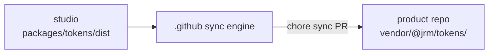

# JRM Studio

The **design + tooling kernel** for JRM Studio (`@jrm` namespace). This pnpm + Turbo
monorepo holds the shared packages every product repo consumes — Next.js (`jrm-recipes`),
a Svelte/Vite PWA (`score-king`), a Gradle+Turbo app (`finance`), a cross-platform game
library tracker (`cartridge`), and a pure-client media hub (`libro`) — so they all share
**one design-token source of truth** and **one set of config presets**.

JRM Studio is **registry-free**: nothing here is ever published. `@jrm` is an identifier,
never a name resolved from a package registry. Built tokens reach product repos as committed
bytes copied by the sync engine in
[`jrmoulckers/.github`](https://github.com/jrmoulckers/.github) — see
[How products receive `@jrm/tokens`](#how-products-receive-jrmtokens).

Per-product themes = swap the semantic palette while keeping the system (names, components,
scales, and build outputs stay identical).

## What's inside

| Package                                            | Role                                                                                                                        |
| -------------------------------------------------- | --------------------------------------------------------------------------------------------------------------------------- |
| [`@jrm/tokens`](packages/tokens)                   | DTCG design tokens (seeded from score-king) → **CSS custom properties**, a **Tailwind preset**, and **typed JS/TS** objects |
| [`@jrm/tailwind-preset`](packages/tailwind-preset) | Ready-to-use Tailwind preset that consumes `@jrm/tokens`                                                                    |
| [`@jrm/eslint-config`](packages/eslint-config)     | Shared flat ESLint config (`base` + `react`)                                                                                |
| [`@jrm/tsconfig`](packages/tsconfig)               | Base TS config + `react` / `svelte` / `node` variants                                                                       |
| [`@jrm/prettier-config`](packages/prettier-config) | Shared Prettier config (+ Tailwind class sorting)                                                                           |

Everything is `private` + `0.0.0` — built and verified locally, never published.

Engineering decisions follow the realm tree in [`principles/`](principles); see
[`AGENTS.md`](AGENTS.md) for how contributors and agents are expected to apply it.

## Workspace commands

```bash
pnpm install          # install all workspace deps
pnpm build            # turbo run build (ordered: tokens → tailwind-preset)
pnpm -r build         # recursive build (same outputs)
pnpm typecheck        # tsc --noEmit across the repo
pnpm lint             # eslint .
pnpm format           # prettier --write .
pnpm tokens:dist      # rebuild tokens, then refresh the committed dist/ tree
pnpm tokens:dist:check # CI gate — fails if dist/ has drifted from the token sources
```

`@jrm/tokens` compiles its DTCG sources with Style Dictionary into **two** trees:

| Tree                     | Committed?                                    | Purpose                                                                                |
| ------------------------ | --------------------------------------------- | -------------------------------------------------------------------------------------- |
| `packages/tokens/build/` | No — git-ignored, regenerated by `pnpm build` | Style Dictionary's raw output; what this monorepo's own `exports` map points at        |
| `packages/tokens/dist/`  | **Yes** — the distribution artifact           | Byte-for-byte interface the sync engine copies into product repos (`pnpm tokens:dist`) |

Both hold the same layout:

```
css/default/{tokens,tokens-dark,tokens-dark-oled,tokens-high-contrast,index}.css
tailwind/default.cjs
js/{index.js, index.d.ts, default/tokens.<mode>.{js,d.ts}}
```

`dist/` is assembled deterministically (stable walk order, LF-normalized, `.gitattributes`
pins `packages/tokens/dist/** text eol=lf`), so committed bytes don't churn across rebuilds
or platforms. CI runs `pnpm tokens:dist:check` and fails if `dist/` drifts from the sources —
if it does, run `pnpm tokens:dist` and commit the result.

## Theming & color modes

The CSS output defines **four** color modes on top of framework-agnostic CSS variables:

- **`:root`** — the `light` (default) palette + every primitive, semantic, and component var.
- **`[data-theme="dark"]`** — the canonical dark palette (the score-king app boots in dark).
- **`[data-theme="dark-oled"]`** — true-black (`#000`) surfaces for OLED displays.
- **`[data-theme="high-contrast"]`** — a max-contrast, light-based mode.

Component vars in `:root` reference **semantic names** (`var(--semantic-interactive-default)`,
with flat `var(--color-primary)` aliases kept for back-compat), and each theme block only
restates those semantic colors — so a runtime mode swap re-flows every component and utility
with **no rebuild**.

`index.css` also bakes in system-preference auto-switching, each guarded by
`:root:not([data-theme])` so an explicit `[data-theme]` always wins:

| Query                            | Effect                                      |
| -------------------------------- | ------------------------------------------- |
| `prefers-color-scheme: dark`     | dark palette                                |
| `prefers-contrast: more`         | high-contrast palette + CVD-safe chart ramp |
| both of the above                | brighter dark/high-contrast combination     |
| `prefers-reduced-motion: reduce` | motion durations collapse to `0ms`          |

```html
<html>
  <!-- light (default), or auto per OS preference -->
  <html data-theme="dark">
    <!-- dark -->
    <html data-theme="dark-oled">
      <!-- true-black OLED -->
      <html data-theme="high-contrast">
        <!-- high contrast -->
        <html data-a11y-cognitive="true">
          <!-- larger type, relaxed leading, motion off -->
        </html>
      </html>
    </html>
  </html>
</html>
```

`data-a11y-cognitive` is orthogonal to `data-theme` and can be combined with any mode.

---

## How products receive `@jrm/tokens`

There is no registry step. The sync engine in
[`jrmoulckers/.github`](https://github.com/jrmoulckers/.github) shallow-clones this repo and
mirrors the committed `packages/tokens/dist/` tree **verbatim** into each opted-in product
repo as a `chore(sync)` PR — it never runs this build.



Opting a product in is a change to `studio.config.json` **in the backbone repo**, not here:

```jsonc
{ "repo": "jrmoulckers/libro", "tokens": { "enabled": true } }
// default target: vendor/@jrm/tokens — overridable per member, e.g.
// finance uses apps/web/vendor/@jrm/tokens so Vite resolves the CSS @import cleanly
```

### What a product repo actually gets

Only the token `dist/` tree is vendored. The four config packages are **monorepo-internal
today** — nothing syncs them, and a registry-free product repo cannot resolve `@jrm/…` as a
package specifier:

| Package                | Available to product repos?                                                                                                        |
| ---------------------- | ---------------------------------------------------------------------------------------------------------------------------------- |
| `@jrm/tokens`          | ✅ vendored at `vendor/@jrm/tokens/`                                                                                               |
| `@jrm/tailwind-preset` | ❌ not synced — point Tailwind at `vendor/@jrm/tokens/tailwind/default.cjs` and re-declare the container/animation extras yourself |
| `@jrm/eslint-config`   | ❌ not synced — copy the flat config into the product repo                                                                         |
| `@jrm/tsconfig`        | ❌ not synced — inline the compiler options                                                                                        |
| `@jrm/prettier-config` | ❌ not synced — copy `prettier.config.mjs`                                                                                         |

Consequences for the examples below:

- **Product repos import by path, not by package specifier.** `@import "@jrm/tokens/css"`
  only resolves _inside this monorepo_, where pnpm workspace links exist. A product repo uses
  the vendored path — `vendor/@jrm/tokens/css/default/index.css`.
- **Never hand-edit vendored files.** Each carries a provenance header, and the sync engine
  hashes them to detect drift; a local edit is flagged and left unreconciled.
- The `"extends": "@jrm/tsconfig/…"` / `presets: [require("@jrm/tailwind-preset")]` forms
  shown in the sections below are **valid inside this monorepo only**.

---

## Consuming in **Next.js** (e.g. `jrm-recipes`)

**1. Import the CSS variables** once in your global stylesheet, from the vendored path:

```css
/* app/globals.css */
@import '../vendor/@jrm/tokens/css/default/index.css'; /* :root + [data-theme] + auto-switching */
@tailwind base;
@tailwind components;
@tailwind utilities;
```

**2. Point Tailwind at the vendored preset:**

```ts
// tailwind.config.ts
import type { Config } from 'tailwindcss';

export default {
  presets: [require('./vendor/@jrm/tokens/tailwind/default.cjs')],
  content: ['./app/**/*.{ts,tsx,mdx}', './components/**/*.{ts,tsx}'],
} satisfies Config;
```

**3. Set the mode** on `<html>` (persist the user's choice however you like):

```tsx
// app/layout.tsx
export default function RootLayout({ children }: { children: React.ReactNode }) {
  return (
    <html lang="en" data-theme="dark">
      <body>{children}</body>
    </html>
  );
}
```

**4. Use the typed tokens** in TS where you need raw values (charts, canvas, inline styles):

```ts
import { tokens, tokensDark } from './vendor/@jrm/tokens/js/index.js';

const brand = tokens.color.primary; // "#7c5cff"
const darkBg = tokensDark.semantic.background.primary; // "#0f1020"
```

> The flat `color.*` aliases resolve in the light build only; use the `semantic.*` path for
> other modes. Prefer `semantic.*` in new code either way.

**5. Extend the shared configs** — inside this monorepo. Product repos copy these in (see
[What a product repo actually gets](#what-a-product-repo-actually-gets)):

```jsonc
// tsconfig.json
{ "extends": "@jrm/tsconfig/react.json" }
```

```js
// eslint.config.js  (flat)
import { base } from '@jrm/eslint-config';
import react from '@jrm/eslint-config/react';
export default [...base, ...react];
```

```jsonc
// package.json
{ "prettier": "@jrm/prettier-config" }
```

---

## Consuming in **Svelte / Vite PWA** (e.g. `score-king`)

**1. Import the CSS variables** in your app entry CSS — they're plain custom properties, so
they work in Svelte with zero framework glue:

```css
/* src/app.css */
@import '../vendor/@jrm/tokens/css/default/index.css';
```

```svelte
<!-- Component styles reference the same semantic vars -->
<div class="card">…</div>

<style>
  .card {
    background: var(--color-surface);
    color: var(--color-text);
    border-radius: var(--radius-md);
    box-shadow: var(--shadow-lift);
    transition: border-color var(--motion-state-duration) var(--motion-state-easing);
  }
</style>
```

**2. (Optional) Tailwind** — if the PWA uses Tailwind, point it at the vendored preset:

```js
// tailwind.config.js
module.exports = {
  presets: [require('./vendor/@jrm/tokens/tailwind/default.cjs')],
  content: ['./index.html', './src/**/*.{svelte,ts,js}'],
};
```

**3. Set the mode** on the document element:

```ts
document.documentElement.dataset.theme = 'dark'; // "dark-oled" | "high-contrast", or remove for light
```

**4. Typed tokens** work in Svelte `<script>` too:

```ts
import { themes } from '../vendor/@jrm/tokens/js/index.js';
const playerColors = Object.values(themes.dark.color.player); // 12-color avatar palette
```

**5. Shared configs:** monorepo-internal only — `"extends": "@jrm/tsconfig/svelte.json"`
resolves here, but a product repo inlines the equivalent options.

---

## Consuming in a **React PWA**

**1. Import the CSS variables** in your root stylesheet:

```css
/* src/index.css */
@import '../vendor/@jrm/tokens/css/default/index.css';
@tailwind base;
@tailwind components;
@tailwind utilities;
```

**2. Apply the Tailwind preset:**

```js
// tailwind.config.cjs
module.exports = {
  presets: [require('./vendor/@jrm/tokens/tailwind/default.cjs')],
  content: ['./index.html', './src/**/*.{ts,tsx}'],
};
```

Now theme-aware utilities are available: `bg-background`, `text-foreground`, `bg-primary`,
`text-accent-ink`, `rounded-md`, `shadow-lift`, `text-player-3`, …

> `animate-pop-in` / `animate-fade-in` and the `container` defaults come from
> `@jrm/tailwind-preset`, **not** from the vendored token preset. Product repos that want them
> declare the keyframes locally.

**3. Set / toggle the mode:**

```tsx
type Mode = 'light' | 'dark' | 'dark-oled' | 'high-contrast';

function setTheme(mode: Mode) {
  if (mode === 'light') delete document.documentElement.dataset.theme;
  else document.documentElement.dataset.theme = mode;
}
```

**4. Typed tokens** for anything CSS can't reach:

```tsx
import { tokens } from '../vendor/@jrm/tokens/js/index.js';
<Sparkline stroke={tokens.semantic.status.positive} />;
```

**5. Shared configs:** monorepo-internal only (`"extends": "@jrm/tsconfig/react.json"` +
the ESLint/Prettier presets); product repos copy the equivalents in.

---

## Adding a product theme

1. Copy `packages/tokens/tokens/themes/default/` to `…/themes/<your-theme>/`. That's six
   files: `color.primitive.json`, the four `color.semantic.<mode>.json` files
   (`light` / `dark` / `dark-oled` / `high-contrast`), and `color.alias.json`.
2. Restyle the values, **keeping every semantic name** — that's the contract. Primitive
   scales, semantic typography/motion/cognitive tokens, and all component bindings are reused
   unchanged.
3. Register the theme in `packages/tokens/config/style-dictionary.config.mjs`. Note that the
   theme is currently a hardcoded constant (`const THEME = 'default'`), so adding a second
   theme means turning that into a loop over theme directories, not just adding an entry.
4. Run `pnpm tokens:dist` and **commit the regenerated `packages/tokens/dist/`** — that tree
   is the artifact product repos receive, and `pnpm tokens:dist:check` fails CI if it's stale.

## Constraints

- **Registry-free, permanently** — nothing is published; `@jrm` is only ever an identifier.
  `pnpm install` / `pnpm build` / `pnpm -r build` are for local verification, and tokens reach
  products via the sync engine (see
  [How products receive `@jrm/tokens`](#how-products-receive-jrmtokens)).
- **`packages/tokens/dist/` is committed** — regenerate with `pnpm tokens:dist` whenever token
  sources change; CI enforces freshness, and `.prettierignore` keeps formatters away from it.
- **`dist/` must stay text-only** — the sync engine reads every file as UTF-8, so a binary
  artifact there would be silently corrupted in every member repo. Ship binaries some other way.
- **Tokens are framework-agnostic** — the CSS-vars output works in plain CSS, Svelte, and
  React alike.
- Follow the realm principles in [`principles/`](principles); conventional-commit style; no
  secrets.
